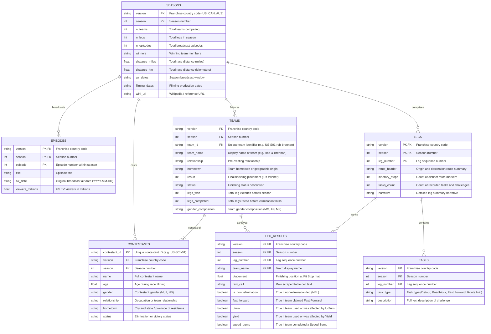

# The Amazing Race Dataset: Data Dictionary & Relational Schema

This document provides complete column-level definitions, data types, relational keys, constraints, and query guidelines for the 7 processed relational tables in **The Amazing Race (TAR)** dataset.

The dataset follows tidy data principles inspired by `doehm/alone`, expanded to model TV game show competition mechanics, route itineraries, and AI training corpora.

---

## Relational Entity-Relationship Diagram



---

## Detailed Table Schemas

### 1. `seasons`
- **File**: `data/processed/seasons.parquet` / `data/processed/seasons.csv` / `seasons` table in `tar.db`
- **Primary Key**: `(version, season)`
- **Description**: High-level metadata, production timelines, distance traversed, and championship results for each season.

| Column Name | Data Type | Nullable | Description | Example |
| :--- | :--- | :---: | :--- | :--- |
| `version` | `VARCHAR(10)` | No | Franchise country code (e.g. `US`, `CAN`, `AUS`). Part of composite primary key. | `"US"` |
| `season` | `INTEGER` | No | Sequential season number within the franchise. Part of composite primary key. | `1` |
| `n_teams` | `INTEGER` | No | Number of teams competing at the start of the race. | `11` |
| `n_legs` | `INTEGER` | No | Total number of race legs in the season. | `13` |
| `n_episodes` | `INTEGER` | No | Total number of broadcast television episodes. | `13` |
| `winners` | `VARCHAR(255)` | Yes | Names of the racers on the winning team. | `"Rob Frisbee and Brennan Swain"` |
| `distance_miles`| `DOUBLE` | Yes | Total official race route distance in miles. | `35000.0` |
| `distance_km` | `DOUBLE` | Yes | Total official race route distance in kilometers. | `56000.0` |
| `air_dates` | `TEXT` | Yes | Premiere and finale broadcast date range. | `"September 5 – December 13, 2001"` |
| `filming_dates` | `TEXT` | Yes | Production filming window. | `"March 8 – April 8, 2001"` |
| `wiki_url` | `TEXT` | Yes | Source Wikipedia or Fandom article URL. | `"https://en.wikipedia.org/wiki/The_Amazing_Race_1"` |

---

### 2. `episodes`
- **File**: `data/processed/episodes.parquet` / `data/processed/episodes.csv` / `episodes` table in `tar.db`
- **Primary Key**: `(version, season, episode)`
- **Foreign Keys**: `(version, season)` references `seasons(version, season)`
- **Description**: Broadcast episode schedule, titles, and television viewership ratings.

| Column Name | Data Type | Nullable | Description | Example |
| :--- | :--- | :---: | :--- | :--- |
| `version` | `VARCHAR(10)` | No | Franchise country code. Foreign key to `seasons`. | `"US"` |
| `season` | `INTEGER` | No | Season number. Foreign key to `seasons`. | `1` |
| `episode` | `INTEGER` | No | Episode number within the season. | `1` |
| `title` | `VARCHAR(255)` | Yes | Official episode title (often a racer quotation). | `"The Race Begins"` |
| `air_date` | `VARCHAR(32)` | Yes | Episode original air date (`YYYY-MM-DD`). | `"2001-09-05"` |
| `viewers_millions`| `DOUBLE` | Yes | Live Nielsen TV viewership in millions. | `11.83` |

---

### 3. `teams`
- **File**: `data/processed/teams.parquet` / `data/processed/teams.csv` / `teams` table in `tar.db`
- **Primary Key**: `team_id`
- **Foreign Keys**: `(version, season)` references `seasons(version, season)`
- **Description**: Competing two-person (or four-person in Family Edition) teams, relationships, and aggregate season outcomes.

| Column Name | Data Type | Nullable | Description | Example |
| :--- | :--- | :---: | :--- | :--- |
| `version` | `VARCHAR(10)` | No | Franchise country code. Foreign key to `seasons`. | `"US"` |
| `season` | `INTEGER` | No | Season number. Foreign key to `seasons`. | `1` |
| `team_id` | `VARCHAR(64)` | No | Unique slug identifier for the team. | `"US-S01-rob-brennan"` |
| `team_name` | `VARCHAR(255)` | No | Common display team name. | `"Rob & Brennan"` |
| `relationship` | `VARCHAR(255)` | Yes | Characterization of racer relationship. | `"Lawyers & Best Friends"` |
| `hometown` | `VARCHAR(255)` | Yes | Origin city and state of team members. | `"Minneapolis, Minnesota"` |
| `result` | `INTEGER` | Yes | Final placement in season (`1` for winners, `2` for runners-up, etc.). | `1` |
| `status` | `VARCHAR(255)` | Yes | Text description of finishing status. | `"Winner"` |
| `legs_won` | `INTEGER` | No | Count of legs where team checked in 1st at Pit Stop. | `5` |
| `legs_completed`| `INTEGER` | No | Total legs raced before elimination or finale check-in. | `13` |
| `gender_composition` | `VARCHAR(10)` | No | Team gender composition (`MM`, `FF`, `MF`). | `"MM"` |

---

### 4. `contestants`
- **File**: `data/processed/contestants.parquet` / `data/processed/contestants.csv` / `contestants` table in `tar.db`
- **Primary Key**: `contestant_id`
- **Foreign Keys**: `(version, season)` references `seasons(version, season)`
- **Description**: Individual racer biographical profiles, age, hometown, and personal statistics.

| Column Name | Data Type | Nullable | Description | Example |
| :--- | :--- | :---: | :--- | :--- |
| `version` | `VARCHAR(10)` | No | Franchise country code. Foreign key to `seasons`. | `"US"` |
| `season` | `INTEGER` | No | Season number. Foreign key to `seasons`. | `1` |
| `contestant_id` | `VARCHAR(32)` | No | Unique alphanumeric racer identifier. | `"US-S01-21"` |
| `name` | `VARCHAR(255)` | No | Full legal/stage name of the contestant. | `"Rob Frisbee"` |
| `age` | `DOUBLE` | Yes | Age of contestant at time of filming. | `27.0` |
| `gender` | `VARCHAR(10)` | No | Individual racer gender (`M`, `F`, `NB`). | `"M"` |
| `relationship` | `VARCHAR(255)` | Yes | Occupation or relationship status. | `"Lawyers & Best Friends"` |
| `hometown` | `VARCHAR(255)` | Yes | Contestant home city and state. | `"Minneapolis, Minnesota"` |
| `status` | `VARCHAR(255)` | Yes | Elimination or winner status description. | `"Winners"` |

---

### 5. `legs`
- **File**: `data/processed/legs.parquet` / `data/processed/legs.csv` / `legs` table in `tar.db`
- **Primary Key**: `(version, season, leg_number)`
- **Foreign Keys**: `(version, season)` references `seasons(version, season)`
- **Description**: Individual legs of the race, geographical routes, and narrative overviews.

| Column Name | Data Type | Nullable | Description | Example |
| :--- | :--- | :---: | :--- | :--- |
| `version` | `VARCHAR(10)` | No | Franchise country code. Foreign key to `seasons`. | `"US"` |
| `season` | `INTEGER` | No | Season number. Foreign key to `seasons`. | `1` |
| `leg_number` | `INTEGER` | No | Sequential leg index within the season (1-indexed). | `1` |
| `route_header` | `TEXT` | Yes | International or domestic itinerary summary. | `"United States → South Africa → Zambia"` |
| `itinerary_stops`| `INTEGER` | No | Count of discrete route stops and clues visited. | `11` |
| `tasks_count` | `INTEGER` | No | Count of recorded challenges in this leg. | `5` |
| `narrative` | `TEXT` | Yes | Full text leg summary from production notes. | `"Teams departed Central Park in New York..."` |

---

### 6. `leg_results`
- **File**: `data/processed/leg_results.parquet` / `data/processed/leg_results.csv` / `leg_results` table in `tar.db`
- **Primary Key**: `(version, season, leg_number, team_name)`
- **Foreign Keys**:
  - `(version, season, leg_number)` references `legs(version, season, leg_number)`
  - `(version, season)` references `seasons(version, season)`
- **Description**: Leg-by-leg finishing placement for each team, pit stop order, and hazard indicators.

| Column Name | Data Type | Nullable | Description | Example |
| :--- | :--- | :---: | :--- | :--- |
| `version` | `VARCHAR(10)` | No | Franchise country code. | `"US"` |
| `season` | `INTEGER` | No | Season number. | `1` |
| `leg_number` | `INTEGER` | No | Leg number. | `1` |
| `team_name` | `VARCHAR(255)` | No | Name of competing team. | `"Rob & Brennan"` |
| `placement` | `DOUBLE` | Yes | Numeric placement at the Pit Stop (1 = 1st place). | `1.0` |
| `raw_cell` | `VARCHAR(64)` | Yes | Raw text from results matrix (including footnote tags). | `"1st ƒ"` |
| `is_non_elimination` | `BOOLEAN` | No | `True` if leg was a designated non-elimination leg (NEL). | `False` |
| `fast_forward` | `BOOLEAN` | No | `True` if team successfully claimed the Fast Forward. | `True` |
| `uturn` | `BOOLEAN` | No | `True` if team used or was victimized by a U-Turn. | `False` |
| `yield` | `BOOLEAN` | No | `True` if team used or was delayed by a Yield. | `False` |
| `speed_bump` | `BOOLEAN` | No | `True` if team completed a Speed Bump penalty task. | `False` |

---

### 7. `tasks`
- **File**: `data/processed/tasks.parquet` / `data/processed/tasks.csv` / `tasks` table in `tar.db`
- **Foreign Keys**: `(version, season, leg_number)` references `legs(version, season, leg_number)`
- **Description**: Discrete tasks, challenges, Detour choices, Roadblocks, and Route Info markers.

| Column Name | Data Type | Nullable | Description | Example |
| :--- | :--- | :---: | :--- | :--- |
| `version` | `VARCHAR(10)` | No | Franchise country code. | `"US"` |
| `season` | `INTEGER` | No | Season number. | `1` |
| `leg_number` | `INTEGER` | No | Leg number where the challenge took place. | `1` |
| `task_type` | `VARCHAR(64)` | Yes | Task category (`Detour`, `Roadblock`, `Fast Forward`, `Speed Bump`, `Route Info`). | `"Fast Forward"` |
| `description` | `TEXT` | Yes | Descriptive text explaining the challenge mechanics and location. | `"One team member had to hike down a canyon to the Boiling Pot..."` |

---

## Analytical Metrics & Query Patterns

### Racing Average Formula
Racing Average (RA) is the standard metric used in the Amazing Race statistical community to evaluate a team's speed and consistency across all legs raced:

$$\text{Racing Average} = \frac{\sum_{i=1}^{L} \text{Placement}_i}{L}$$

*Where $L$ is the number of completed legs.* Lower scores represent superior racing performance.

#### SQL Query Example
```sql
SELECT
    version,
    season,
    team_name,
    COUNT(*) AS legs_raced,
    ROUND(AVG(placement), 2) AS racing_average
FROM leg_results
WHERE placement IS NOT NULL
GROUP BY version, season, team_name
HAVING legs_raced >= 10
ORDER BY racing_average ASC
LIMIT 10;
```

#### Pandas Query Example
```python
import pandas as pd

df = pd.read_parquet("data/processed/leg_results.parquet")
ra = (
    df.groupby(["version", "season", "team_name"])["placement"]
    .agg(legs_raced="count", racing_average="mean")
    .query("legs_raced >= 10")
    .sort_values("racing_average")
    .reset_index()
)
print(ra.head(10))
```

#### R Query Example
```r
library(theamazingrace)
library(dplyr)

data(leg_results)

ra <- leg_results |>
  group_by(version, season, team_name) |>
  summarize(
    legs_raced = n(),
    racing_average = round(mean(placement, na.rm = TRUE), 2),
    .groups = "drop"
  ) |>
  filter(legs_raced >= 10) |>
  arrange(racing_average)

print(head(ra, 10))
```
